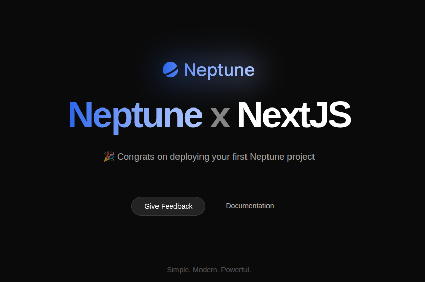

<div align="center">
  
</div>

---

<div align="center">

# Next.js Template

This is a simple Next.js app. You can ask your AI agent to deploy to Neptune.

</div>

<div align="center">
  
</div>

## What is Neptune?

Neptune is an AI-native platform engineer. Once you install the Neptune MCP, you can just ask your AI agent to do the deployment for you, without any manual configuration.

## Deploy to Neptune

### Install Neptune

```bash
curl -fSsL https://neptune.dev/install.sh | bash
```

### Add Neptune to Claude Code

After installation, add Neptune to your `mcp.json`:

```json
{
  "mcpServers": {
    "Neptune": {
      "command": "neptune",
      "args": ["mcp"]
    }
  }
}
```

Or use the Claude Code command:

```bash
claude mcp add Neptune neptune mcp
```

### Deploy

Simply ask your AI agent:

```txt
deploy to neptune
```

That's it! Your app will be deployed and accessible via a public URL.
